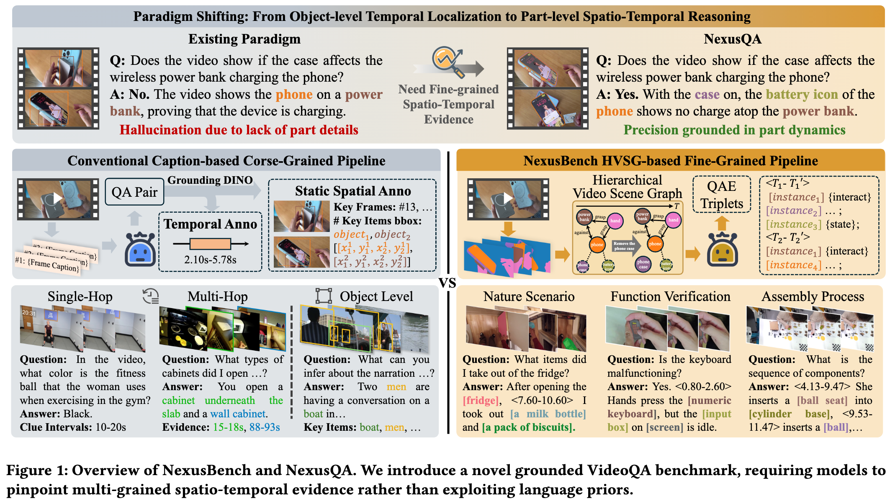
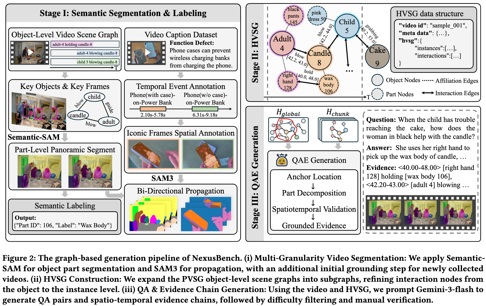
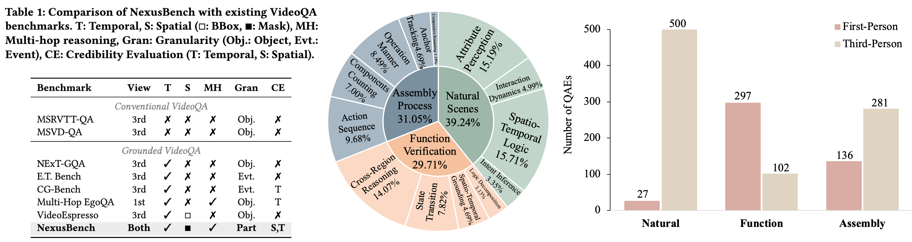
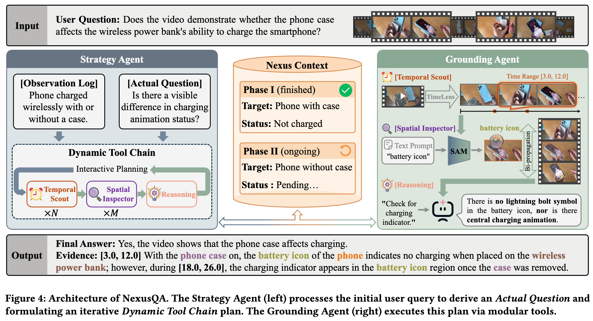
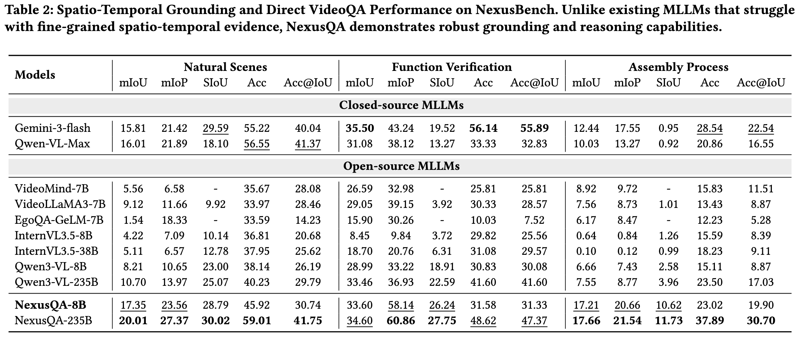
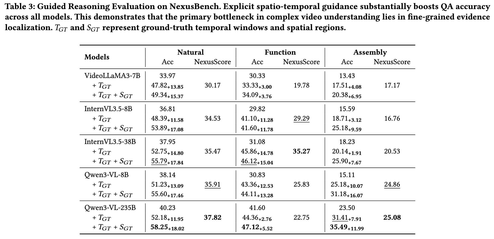
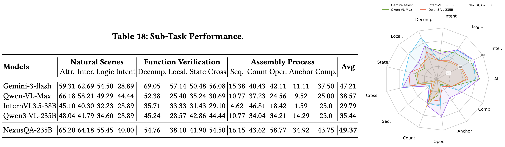

# NexusBench & NexusQA

<!-- [](https://huggingface.co/datasets/Nexus)  -->

## Introduction

This repository addresses the "blind reasoning" issue in Multimodal Large Language Models (MLLMs) for VideoQA—where models rely on language priors rather than genuine visual grounding—by providing a comprehensive framework for exploring multi-grained spatio-temporal evidence. 

**NexusBench** is a novel benchmark constructed upon the Hierarchical Video Scene Graph (HVSG) that advances visual evidence from coarse-grained objects to part-level dynamic mask tubes, compelling models to perform joint reasoning and verification across multi-grained spatio-temporal dimensions. 

As a highly competitive training-free baseline, **NexusQA** employs a "plan-act" collaborative architecture, leveraging dynamic interaction between a Strategy Agent and a Grounding Agent to precisely retrieve fine-grained evidence and drive reliable visual reasoning.




## Release Process
- [ ] **NexusBench**
  - [ ] Dataset: Question-answer pairs with evidence annotations
  - [ ] Model evaluation code
  - [ ] Metrics and judging scripts
- [ ] **NexusQA**
  - [ ] Inference pipeline
  - [ ] Prompts


## NexusBench


**Structure:**
- **Nature Scenes**: 527 QA pairs about daily environment interactions
- **Function Verification**: 399 QA pairs examining functional relationships
- **Assembly Process**: 417 QA pairs focusing on object assembly sequences

Each QA pair follows a standardized template with:
- Video ID and URL
- Question and complete answer
- Evidence annotations (temporal intervals and spatial bounding boxes)

```json
{
    "video_id": "xxx",
    "video_url": "xxx",
    "question": "xxx",
    "answer_complete": "xxx",
    "evidence": {
        "temporal": {
            "<T1>": ["start time/frame index", "end time/frame index"],
            "<T2>": ["start time/frame index", "end time/frame index"]
        },
        "spatial": {
            "instance_1_name": "{id_1}",
            "instance_2_name": "{id_2}"
        }
    },
    "type": "{QA type classification}"
}
```


## NexusQA

NexusQA provides an advanced evaluation framework featuring:
- "Plan-Act" Collaborative Architecture: Decouples complex VideoQA tasks into specialized roles, utilizing a Strategy Agent for task concretization and a Grounding Agent for dynamic evidence collection.
- Multi-Grained Grounding Tools: Integrates specialized tool calls ([Temporal Scout Tool], [Spatial Inspector Tool], and [Reasoning Tool]) to precisely locate temporal event intervals and track fine-grained spatial details (e.g., part-level masklets).
- Dynamic Context Accumulation: Employs a shared Nexus Context that prevents attention dilution, allowing models to synthesize long temporal sequences and minute spatial details effectively.

The framework supports various evaluation modes:
- Direct answering
- Temporal grounding (+T)
- Temporal + Spatial grounding (+T+S)





## Evaluation



